# 🗺️ Aktivy — Carte de l'application & interfaces MVP

> Mis à jour le 08/10/2026 · Référence : Cahier des charges v2.1 et [SPRINT_1_PERIMETRES.md](../SPRINT_1_PERIMETRES.md)

Aktivy s'organise en **4 espaces** (public, back-office entreprise, terrain mobile, administration plateforme), servis par **3 gabarits de pages**. 8 interfaces sont déjà livrées. Le Sprint 1 en compte **18 à construire maintenant**, dont 2 qui n'ont pas encore de responsable.

---

## 1. Carte de l'application

Tout le monde passe par l'espace public. Après la connexion, c'est le rôle qui décide de l'espace où l'on arrive.

```mermaid
flowchart TB
    PUB["<b>Espace public & authentification</b> ✅ livré<br/>Accueil · Connexion (email ou téléphone) · Inscription entreprise<br/>Mot de passe oublié · Vérification email · Mot de passe temporaire · 2FA"]

    PUB -->|Gérant, Superviseur, Comptable| BO
    PUB -->|Hôtesse| TER
    PUB -->|Super admin| ADM

    subgraph BO["Back-office entreprise — /dashboard"]
        direction TB
        bo1["⚪ Tableau de bord"]
        bo2["🔵 Activité du jour"]
        bo3["🔵 Personnel"]
        bo4["🔵 Sites"]
        bo5["🔵 Affectations"]
        bo6["🔵 Produits & prix"]
        bo7["⚪ Rapports & exports"]
        bo8["🔵 Paramètres entreprise"]
        bo9["🔵 Utilisateurs"]
        bo10["⚪ Abonnement & modules"]
        bo11["✅ Mon compte"]
        bo12["⚪ Aide"]
    end

    subgraph TER["Terrain mobile — /terrain"]
        direction TB
        te1["🔵 Aujourd'hui, prise de poste"]
        te2["🔵 Saisie rapide + / −"]
        te3["🔵 Clôture de la journée"]
        te4["⚪ Historique"]
        te5["⚪ Profil"]
    end

    subgraph ADM["Administration plateforme — /admin"]
        direction TB
        ad1["⚪ Tableau de bord plateforme"]
        ad2["🔵 Entreprises"]
        ad3["⚪ Abonnements & modules"]
        ad4["⚪ Journal d'audit"]
    end
```



Légende : ✅ livré · 🔵 Sprint 1, à faire maintenant · ⚪ après le Sprint 1

> Pour voir le schéma dans VS Code : ouvre l'aperçu Markdown (`Ctrl+Shift+V`). Si le diagramme ne s'affiche pas, installe l'extension « Markdown Preview Mermaid Support ». GitHub l'affiche directement.

---

## 2. Navigation par rôle

Chaque rôle ne voit dans son menu que ce qu'il a le droit d'ouvrir. Une URL tapée à la main en dehors de son périmètre renvoie **403**.

Le gérant, le superviseur et le comptable partagent le même back-office, avec un menu filtré :

| Menu back-office | Route | Gérant | Superviseur | Comptable |
| --- | --- | :---: | :---: | :---: |
| Tableau de bord | `/dashboard` | ✅ | ✅ | Lecture |
| Activité du jour (clôtures à valider) | `/activite` | ✅ | ✅ | — |
| Personnel | `/personnel` | ✅ | ✅ | — |
| Sites | `/sites` | ✅ | ✅ | — |
| Affectations | `/affectations` | ✅ | ✅ | — |
| Produits & prix | `/produits` | ✅ | ✅ | — |
| Rapports & exports | `/rapports` | ✅ | ✅ | Lecture + export |
| Paramètres de l'entreprise | `/entreprise` | ✅ | — | — |
| Utilisateurs | `/entreprise/utilisateurs` | ✅ | — | — |
| Abonnement & modules | `/entreprise/abonnement` | ✅ | — | — |
| Mon compte, Aide | `/settings`, `/aide` | ✅ | ✅ | ✅ |

Les deux autres rôles ont leur propre espace et leur propre menu :

- **Hôtesse** (`/terrain`, sur mobile) : barre de navigation en bas avec 4 onglets : Aujourd'hui, Saisie, Historique, Profil. La clôture s'ouvre depuis Aujourd'hui en fin de journée.
- **Super administrateur** (`/admin`) : Tableau de bord, Entreprises, Abonnements & modules, Journal d'audit.

---

## 3. Gabarits de pages

Toutes les pages reposent sur 3 gabarits. Seuls le back-office et le terrain restent à construire, et ce sont les **premières tâches du Sprint 1**, car toutes les autres pages en dépendent.

### Back-office — ordinateur et tablette (`app-sidebar-layout`, déjà dans le projet)

```
┌──────────────────┬──────────────────────────────────────────────────┐
│ Aktivy.          │ Personnel › Liste            Démo Events SARL (o)│
│                  ├──────────────────────────────────────────────────┤
│ Tableau de bord  │ Personnel                           [ + Ajouter ]│
│ Activité du jour │                                                  │
│▐Personnel       ▌│ [ Rechercher…               ]  [ Statut ▾ ]      │
│ Sites            │                                                  │
│ Affectations     │ Nom            Téléphone         Statut          │
│ Produits         │ ───────────────────────────────────────────────  │
│ Rapports         │ ▬▬▬▬▬▬         ▬▬▬▬▬▬▬▬          (Actif)         │
│                  │ ▬▬▬▬▬▬         ▬▬▬▬▬▬▬▬          (Actif)         │
│                  │ ▬▬▬▬▬▬         ▬▬▬▬▬▬▬▬          (Actif)         │
│ (o) Gérant Démo  │                                  ‹ 1 2 3 ›       │
└──────────────────┴──────────────────────────────────────────────────┘
```

- Menu latéral filtré par rôle et repliable. Sur petit écran, il devient un tiroir.
- En-tête : fil d'Ariane, nom de l'entreprise, menu utilisateur.
- Page : titre et action principale, puis filtres, puis tableau paginé.
- Les formulaires ont leur propre page. Les confirmations se font dans une boîte de dialogue.
- Le super admin utilise le même gabarit, avec son propre menu.

### Terrain — téléphone (`terrain-layout`, coquille déjà créée)

```
╭──────────────────────────────╮
│ Vous êtes affectée à  ● En ligne
│ Carrefour Dakar              │
│ Poste : journée entière      │
├──────────────────────────────┤
│ Saisie des ventes            │
│ ┌──────────────────────────┐ │
│ │ Produit A    (−)  0  (+) │ │
│ └──────────────────────────┘ │
│ ┌──────────────────────────┐ │
│ │ Produit B    (−)  0  (+) │ │
│ └──────────────────────────┘ │
│ Totaux calculés automatiquement
│ ┏━━━━━━━━━━━━━━━━━━━━━━━━━━┓ │
│ ┃    Valider la saisie     ┃ │
│ ┗━━━━━━━━━━━━━━━━━━━━━━━━━━┛ │
├──────────────────────────────┤
│ Aujourd'hui  Saisie  Historique  Profil
╰──────────────────────────────╯
```

- Pour l'hôtesse uniquement.
- En-tête : site du jour et état de connexion ou de synchronisation, toujours visibles.
- Une seule action principale par écran, en bas, à portée du pouce. Navigation en 4 onglets.

### Authentification (`auth-split-layout`, ✅ livré)

Image à gauche, formulaire à droite. Sur téléphone, il ne reste que le formulaire.

---

## 4. Design system

On garde l'identité de la page d'accueil (Montserrat, ardoise foncée et vert Aktivy) avec les composants shadcn/ui déjà présents dans le projet. **Aucun développeur ne crée de couleur ou de style en dehors de ces jetons.**

### Couleurs

| Jeton | Valeur | Usage |
| --- | --- | --- |
| Ardoise | `#0F172A` | Boutons principaux, titres, carré du logo |
| Vert Aktivy | `#4FC031` | Accents, point du logo, état « validé », bouton principal du terrain |
| Vert foncé | `#2F7D1C` | Liens et texte vert (le vert Aktivy est trop clair pour du petit texte) |
| Fond | `#F1F5F9` | Fond des pages du back-office |
| Carte | `#FFFFFF` + bordure `#E2E8F0` | Cartes, tableaux, formulaires |
| Texte secondaire | `#64748B` | Aides, légendes, métadonnées |
| Avertissement | `#F59E0B` | Saisie en retard, stock bas |
| Erreur | `#DC2626` | Écart de clôture, saisie refusée, compte suspendu |
| Couleur de l'entreprise | `companies.primary_color` | Seulement pour l'en-tête des PDF et exports et le liseré du logo client. Ne remplace jamais une couleur d'état. |

### Typographie et formes

- Montserrat partout : 800 pour le logo, 700 pour les titres de page (24 px), 600 pour les titres de section (18 px), 400 pour le texte.
- Texte courant : 14 px dans le back-office, 16 px minimum sur le terrain. Chiffres et montants en `tabular-nums`.
- Rayon de 12 px pour les boutons et les champs, de 16 px pour les cartes. Icônes Lucide uniquement.

### Composants

- **Déjà disponibles** (shadcn/ui) : Button, Input, Select, Checkbox, Card, Dialog, Sheet, Badge, Sidebar, Breadcrumb, Avatar, toasts Sonner.
- **À créer une seule fois et à partager** : tableau de données (recherche, filtres, tri, pagination), badge de statut, état vide, en-tête de page (titre + actions), compteur `+ / −` du terrain, champ d'upload (logo, photo, documents).

### Formats

Interface en français. Montants : `12 500 FCFA`. Dates : `08/10/2026`. Heures : `14:30`. Téléphone : `+237 676383986`.

### Règles du terrain (hôtesse)

- Conçu pour un Android d'entrée de gamme de 360 px de large, sur un réseau faible.
- Cibles tactiles de 48 px minimum. Une seule action principale par écran, en bas.
- Toujours en thème clair, pour rester lisible en extérieur. Pas d'image lourde. L'état de connexion reste visible en permanence.

---

## 5. Interfaces du Sprint 1 — à faire maintenant

18 interfaces au total : **6 pour le Dev 1, 7 pour le Dev 2, 3 pour le Dev 3, et 2 encore sans responsable**. Mettez à jour la colonne État au fil du sprint.

| N° | Interface | Route | Rôles | Réf. | Dev | État |
| --- | --- | --- | --- | --- | --- | --- |
| 1 | Gabarit back-office : menu par rôle, en-tête entreprise | toutes les pages back-office | Gérant, Superviseur, Comptable | FN-03 | Dev 1 | Fait |
| 2 | Gabarit terrain mobile : site du jour, navigation basse, état hors-ligne | `/terrain/*` | Hôtesse | FN-07, FN-10 | Dev 1 | En cours |
| 3 | Utilisateurs — liste (filtres rôle, statut) | `/entreprise/utilisateurs` | Gérant | FN-03 | Dev 1 | À faire |
| 4 | Utilisateur — créer, modifier, suspendre (rôle, mot de passe temporaire) | `/entreprise/utilisateurs/{id}` | Gérant | FN-03 | Dev 1 | À faire |
| 5 | Paramètres de l'entreprise (logo, couleur, coordonnées) | `/entreprise` | Gérant | FN-02 | Dev 1 | À faire |
| 6 | Admin — Entreprises (liste, suspendre, réactiver) | `/admin/entreprises` | Super admin | FN-02 | Dev 1 | À faire |
| 7 | Personnel — liste (recherche, filtres statut) | `/personnel` | Gérant, Superviseur | FN-04 | Dev 2 | À faire |
| 8 | Personnel — fiche (identité, documents, affectations) | `/personnel/{id}` | Gérant, Superviseur | FN-04 | Dev 2 | À faire |
| 9 | Personnel — formulaire créer, modifier, archiver | `/personnel/create` | Gérant, Superviseur | FN-04 | Dev 2 | À faire |
| 10 | Sites — liste | `/sites` | Gérant, Superviseur | FN-05 | Dev 2 | À faire |
| 11 | Site — fiche (hôtesses affectées, contact sur place) | `/sites/{id}` | Gérant, Superviseur | FN-05 | Dev 2 | À faire |
| 12 | Site — formulaire (adresse, GPS, contact, statut) | `/sites/create` | Gérant, Superviseur | FN-05 | Dev 2 | À faire |
| 13 | Affectations — liste + formulaire (dates, créneau) | `/affectations` | Gérant, Superviseur | FN-05 | Dev 2 | À faire |
| 14 | Produits & prix — catalogue simple | `/produits` | Gérant, Superviseur | FN-07, FN-08 | **À attribuer** | À faire |
| 15 | Aujourd'hui — site du jour + prise de poste | `/terrain` | Hôtesse | FN-07 | Dev 3 | En cours |
| 16 | Saisie rapide — compteurs + / − | `/terrain/saisie` | Hôtesse | FN-07, FN-08, FN-10 | Dev 3 | À faire |
| 17 | Clôture — récapitulatif + motif d'écart | `/terrain/cloture` | Hôtesse | FN-09 | Dev 3 | À faire |
| 18 | Activité du jour — clôtures à valider | `/activite` | Gérant, Superviseur | FN-09 | **À attribuer** | À faire |

**Ordre de construction :**
- Les gabarits 1 et 2 d'abord, car toutes les pages en dépendent.
- Les produits (14) doivent exister avant la saisie (16).
- Les affectations (13) doivent exister avant l'écran Aujourd'hui (15).

**Déjà livrés par le Dev 1 :** accueil, connexion (email ou téléphone), inscription entreprise, mot de passe oublié et réinitialisation, vérification d'email, changement du mot de passe temporaire, double authentification, Mon compte (profil, sécurité, apparence).

---

## 6. Après le Sprint 1

13 interfaces complètent le MVP (FN-01 à FN-13 et FN-32). Elles seront réparties au prochain sprint.

| Interface | Route | Rôles | Réf. |
| --- | --- | --- | --- |
| Tableau de bord entreprise (effectifs, activité du jour, tendance de la semaine) | `/dashboard` | Gérant, Superviseur, Comptable | FN-06 |
| Rapports hebdomadaires et mensuels | `/rapports` | Gérant, Superviseur, Comptable | FN-11 |
| Exports PDF et Excel aux couleurs de l'entreprise | `/rapports` | Gérant, Superviseur, Comptable | FN-12 |
| Abonnement & modules (activation, paiement Mobile Money) | `/entreprise/abonnement` | Gérant | FN-13 |
| Import Excel (personnel, sites, produits) | `/entreprise/import` | Gérant | FN-32 |
| Assistant de démarrage | `/bienvenue` | Gérant | FN-32 |
| Centre d'aide | `/aide` | Tous | FN-32 |
| Historique personnel de l'hôtesse | `/terrain/historique` | Hôtesse | FN-07 |
| Profil terrain (mot de passe, langue) | `/terrain/profil` | Hôtesse | FN-01 |
| Admin — tableau de bord plateforme | `/admin` | Super admin | FN-02 |
| Admin — fiche entreprise (utilisateurs, abonnement) | `/admin/entreprises/{id}` | Super admin | FN-02 |
| Admin — catalogue des modules et tarifs | `/admin/modules` | Super admin | FN-13 |
| Admin — journal d'audit | `/admin/audit` | Super admin | Sécurité |

Les modules V2 et V3 (plannings, pointage, stocks, primes, IA…) ajouteront chacun leur entrée au menu quand l'entreprise les activera. Ils ne sont pas détaillés ici.

---

## 7. Questions ouvertes

Six décisions bloquent ou orientent le Sprint 1. Cochez-les une fois tranchées.

- [ ] **Fiche hôtesse et compte de connexion :** la fiche (Dev 2) et le compte (Dev 1) sont deux choses distinctes. Proposition : un bouton « Créer l'accès » sur la fiche, qui crée le compte avec le téléphone et un mot de passe temporaire.
- [ ] **Produits & prix (n° 14) :** qui le construit ? La saisie du Dev 3 en dépend.
- [ ] **Validation des clôtures (n° 18) :** qui le construit ?
- [ ] **Périmètre du superviseur :** voit-il tous les sites de l'entreprise, ou seulement ceux de son équipe ?
- [ ] **Marché cible :** les numéros sont déjà en +237, mais les entreprises sont créées par défaut au Sénégal (`SN`, `Africa/Dakar`, `XOF`). Faut-il passer au Cameroun (`CM`, `Africa/Douala`, `XAF`) ?
- [ ] **Rôle livreur :** il ne fait pas partie des 5 rôles de la spec. On l'ajoute maintenant, ou avec le module Stocks (V2) ?
